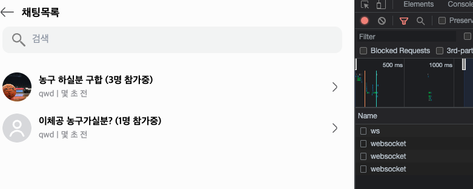
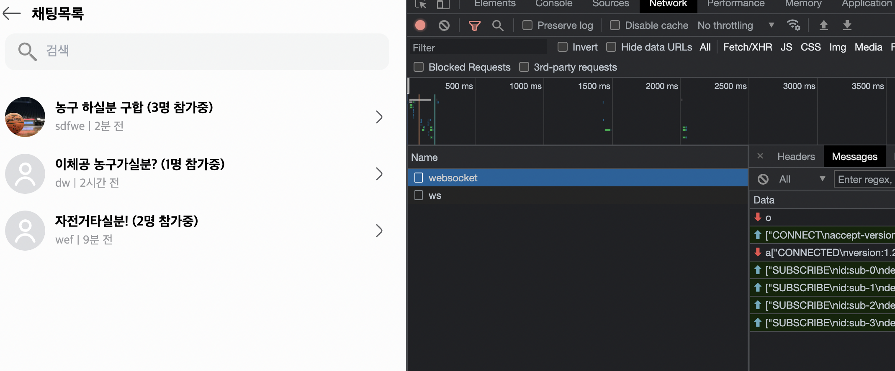
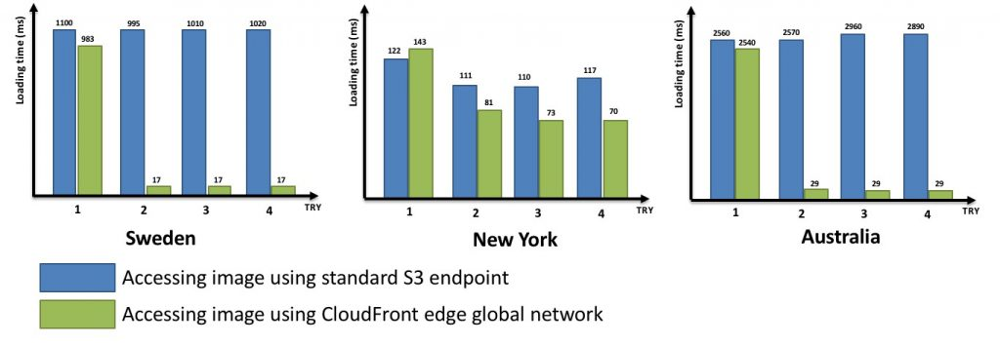

# 매치기 클라이언트

[전체 아키텍처 확인하기](https://github.com/voyage-fianl-team1)

## 📚 주요 기술 스택

             

## 💻 Code Reusability

- 컴포넌트에서 모든 비즈니스로직을 분리하여 custom hook 으로 구현한 [hooks pattern](https://blog.bitsrc.io/new-react-design-pattern-return-component-from-hooks-79215c3eac00) 을 따르고 있습니다.(서비스에서 사용된 모든 로직은 내부 구현사항에 상관없이 재사용가능합니다.)

## 💁 역할

### 태민

- **회원가입 및 로그인(+카카오)**
  - axios intercept를 이용한 401 에러시 refresh 요청
- **채팅 및 실시간 알림**
  - 부실했던 공식문서를 대신해 useStomp() 커스텀 훅으로 구현
- **마이페이지**
  - 내 정보의 특성상 본인이 직접 수정하지 않는 이상 데이터가 변할일이 없는 부분은 캐싱 활용하기
- **CI/CD**
  - github Actions 으로 CI/CD 파이프라인 구축하기
- **배포**
  - AWS S3 + CloudFront + Route53 배포환경 구축

### 지민
 
- **경기목록**
  - react-intersection-observer와 react-query에 infinity query를 이용하여 구현
- **경기 CRUD**
  - 이미지 업로드시 이미지가 5mb 이상일 경욱 압축하여 서버로 전송
- **댓글**
- **참가목록 및 경기결과**
  - 사용자가 목록 및 결과를 바로 볼 수 있게 쿼리 최신화 시켜주기
- **검색 및 정렬**
- **지도(카카오)**
  - react-kakao-map-sdk 라이브러리를 활용하여 구현, 사용자가 원하는 위치만큼만 데이터 받아오기
- **PWA**
  - PWA를 적용하여 유저 접근성 높이기

## 🌠 트러블 Shooting

### Socket 연결 과부화

#### 요구사항

stomp 연결을 채팅방 채널(n) + 알림채널(1)로 n+1개 연결로인한 과부하 문제가 발생

#### 해결방안

기존에 개발했던 stomp 통신을 위한 custom hook 을 리팩토링하여, 하나의 객체로 socket을 연결하고 subscribe(구독)를 n개 할 수 있도록  `useStomp()` `useChatStomp()`, `useNotificatinoStomp()` hook 을만들어 사용했다.

---

### Stomp 연결 header의 부재

#### 요구사항

StompJS는 최초연결시 header를 담는 공간을 제한해 두었기 떄문에, 연결시에 token을 보내 사용자를 인증할 수 없었다.

#### 해결방안

최초 연결이 아닌, 전송하는 메세지 마다는 header를 포함 할 수 있어서, 메시지 전송시마다 accessToken을 전달하여 인증을 구현하였다.

---

### 접근성을 높여라! PWA

#### 요구사항

웹으로만 서비스 한다면 모바일 위주에 현재 시장에서 상대적으로 접근성이 떨어지며 수시로 접속해 현황을 체크해야 하는 서비스 특성상 매 서비스 이용마다 URL을 입력하거나 북마크를 사용해야하는 등 유저가 서비스에 접근하는 단계가 많아지기에 UX가 저해 됨.

#### 해결방안

PWA 환경으로 배포하여 웹앱으로 사용가능하게 하여 별도에 URL이나 북마크 없이 한번의 다운로드로 마치 앱처럼 서비스를 이용 가능하게 함.

---

### 지도에서 내 근처 게시글 효율적으로 불러오기

#### 요구사항

내 위치 주변 특정 반경 내에 경기 데이터를 불러 올 때 무한스크롤을 이용해 지도 축소 시 무한스크롤 이용해데이터를 불러오려고 했으나 지도는 고정적으로 움직이지 않아 무한스크롤을 적용하기가 어려웠다. 그래서 지도를 사용하는 서비스를 확인해 어떤 방식으로 데이터를 불러오는지 확인해보기로 했다.

먼저 직방의 경우 지도에 마커 대신 클러스터 기능을 이용해 대략적인 정보만을 보여주었고 클러스터 또한 클라이언트가 아닌 서버에서 관리해주는 듯 했다.

네이버 부동산의 경우는 네트워크 탭에서 확인해 봤을 때 지도의 반경이 변함에 따라 반경 안에 데이터를 다시 불러오는 것으로 보여졌다. 직방의 방식은 백엔드의 코드를 대폭 변경해야 했고 네이버 부동산의 방식은 프론트 및 백엔드 모두 수정할 코드가 적었으며 사용자가 축소한 만큼의 데이터만 불러와 UX상 더 좋을 것 같다고 판단되어 반경 내에 데이터를 불러오는 방식으로 채택했다.

#### 해결방안

(1) 카카오맵 level 이용 (level: 지도 축소 및 확대 단위)

(2) 지도 끝단 북동쪽, 남서쪽의 위도,경도 이용

반경을 이용해서 데이터를 불러오는 방식은 2가지를 생각했다. (1)번을 통해 데이터를 불러온다면 현재 보고 있는 지도의 크기가 변경 될 때 각 level의 경계선 상에 있는 데이터도 불러오지 오지 못하며 사용자가 조금만 축소해서 레벨을 넘어가 버렸을 때 필요없는 데이터도 불러올 수 있어 (2)번 방법을 이용하여 해결했다.

---

### 채팅방의 안읽은 메세지 처리하기

#### 요구사항

유저마다 참여한 채팅방의 읽지 않은 메세지 갯수를 카운팅 하기 위해서, 채팅방 마다 마지막으로 접속한 시간을 저장해야 했다. 처음에는 클라이언트의 `localstorage`에 저장하려고 했으나 이 방법을 쓸 경우 사용자가 다른 브라우저를 사용할 경우 마지막으로 접속한 시간이 달라지는 문제가 발생했다.

#### 해결방안

서버에서 User와 Room의 관계가 `@ManytoMany`로 설정을 하였는데 이 경우 다른 컬럼을 추가하지 못하기 때문에 User와 Room을 `@ManytoOne`의 관계로 변경하고 UserRoom Entity를 새롭게 만들어, 마지막 활동 시간을 저장하는 lastActive 컬럼을 추가하여 해결하였다.

---

### 컨텐츠 전송속도 높이기와 HTTPS

#### 요구사항

1. 사용자가 많아진다면 웹사이트의 접속 속도가 저하될 것으로 예상된다.

2. 브라우저의 보안정책으로 현재위치를 사용하려면 HTTPS 통신이 필요하다.

#### 해결방안

S3를 통해서 배포하는 상황에서의 선택지는 CloudFront밖에 없었다. 하지만 이것으로 정적 컨텐츠 전송속도 향상과 HTTPS 를 적용할 수 있었다.
매치기는 한국에 한정된 서비스이기 때문에 region마다 엣지로케이션이 있는 CloudFront의 장점을 100프로 활용하진 못하겠지만, 아래 공식문서의 통계에 의하면, 캐싱을 통해서 단순히 같은 Region에서의 요청또한 S3보다 CloudFront가 더 빨랐다.

`Route53`(도메인) + `AWS ACM` + `CloudFront` 를 조합하면 보안강화와 더불어 HTTPS로 컨텐츠를 전송할 수 있었다.

---

### 새로고침하면 휘발하는 redux, redux-persist 로 유지하기

#### 요구사항

홈페이지 렌더링 시 현재 위치값을 받아와 이를 리덕스를 이용해 전역적으로 관리하여 지도를 이용하는 컴포넌트에 사용하였는데 리덕스로 관리하다 보니 초기에는 현재 위치가 잘 적용되나 새로고침 시 리덕스에 데이터가 휘발되어 지도가 렌더링 되지 않는 현상이 발생함.

#### 해결방안

(1) props로 내려주어서 지도를 사용하는 컴포넌트에 내려준다.

(2) `SessionStorage` 이나 `LocalStorage` 저장해두어서 필요할 때마다 사용한다.

(1)의 방식을 사용시 단순히 현재위치 값의 전달을 위해 2단계 이상의 `props drilling`이 일어나게 되서 적합하지 않다고 판단했고 (2)번 방법 중 현재 창을 닫았을 때 저장한 값이 사라지는 SessionStorage에 보관하기로 하였고 SessionStorage에 저장하기 위한 방법 중 기존에 리덕스 데이터를 간단하게 SessionStorage이나 LocalStorage 저장할 수 있게 해주는 `Redux-Pesist`를 사용하여 문제를 해결함.

---

### 이미지 리사이징

#### 요구사항

서버에서 10MB 제한을 해두었기 때문에, 10MB를 초과하는 이미지는 실패로 동작한다.

#### 해결방안

compressorjs를 사용해 업로드한 이미지가 5MB 이상이면 압축시켜 전송하여 이미지 업로드가 실패하지 않도록 변경함.

